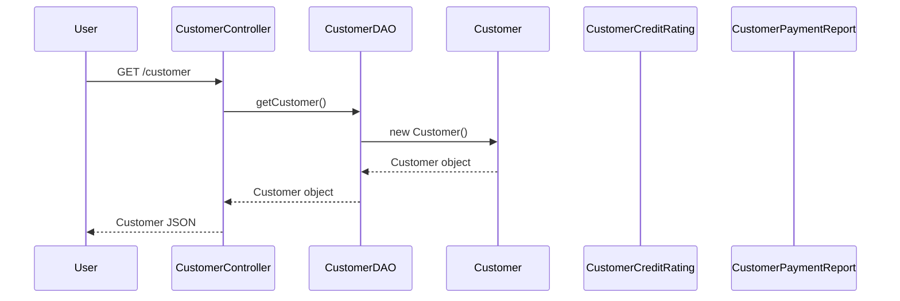

# Sequence Diagram

```mermaid
sequenceDiagram
    participant User
    participant CustomerController
    participant CustomerDAO
    participant Customer
    participant CustomerCreditRating
    participant CustomerPaymentReport

    User->>CustomerController: GET /customer
    CustomerController->>CustomerDAO: getCustomer()
    CustomerDAO->>Customer: new Customer()
    Customer-->>CustomerDAO: Customer object
    CustomerDAO-->>CustomerController: Customer object
    CustomerController-->>User: Customer JSON

```
